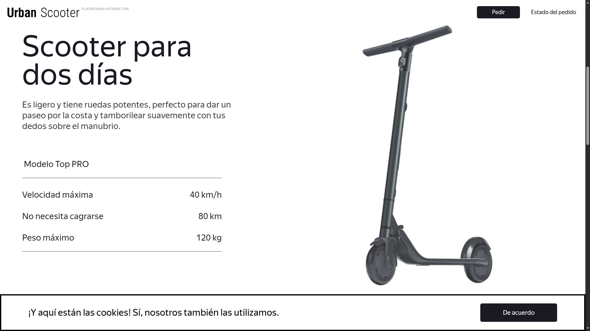

# Urban-Scooter-End-to-End-Testing
> A full-cycle testing project covering Mobile, Web, and API validation for a scooter rental platform.

  

---

## 📋 Project Description
This project focuses on the quality assurance process for the "Urban Scooter" application. It includes the design and execution of **test cases,** bug reporting in **Jira,** and **API validation,** **Cross-browser testing** (Opera and Chrome), **Mobile testing** and **SQL database validation**.

---

###  📂 Project Resources & Assets
#### 🌐 Platform Web:
* **📋 Requirements-Platform Web:** [View Functional Requirements (PDF)](https://practicum-content.s3.us-west-1.amazonaws.com/new-markets/qa-final-project/Requisitos_de_aplicaciones_web.pdf)
* **🎨 UI/UX Design:** [Figma Interactive Prototype](https://www.figma.com/design/r070o8mwcFMhl5ulm8sjfE/Urban-Scooter-WEB?node-id=0-1&p=f)

#### 📱 Mobile App:

* **📋 Requirements-Mobile-App:**[View Functional Requirements (PDF)](https://practicum-content.s3.us-west-1.amazonaws.com/new-markets/qa-final-project/Requisitos_para_la_aplicacin_mvil.pdf)

* **🎨 UI/UX Design:** [Figma Interactive Prototype](https://www.figma.com/design/oTS67jtkFRFA2GOkUOVfu1/Urban-Scooter-mobile?node-id=0-1&p=f)

* 📦 [Download Apk](https://practicum-content.s3.us-west-1.amazonaws.com/new-markets/qa-final-project/ESP/UrbanScooterESP.apk)

#### 🗄️ SQL DataBase:

* [scooter_rent_database_queries.sql](scripts/scooter_rent_database_queries.sql)
* [Order Confirmation](./assert/imagen/Order_Confirmation.png)

    
<b><i>Click here to view 🚀 API Documentation</i></b>
 

   **🚀 API Documentation (Endpoints):**
   
  The project includes REST API validation for courier and order management services.

| Endpoint | Method | Format | Auth | Description |
| :--- | :--- | :--- | :--- | :--- |
| `/api/v1/courier/:id/ordersCount` | GET | JSON | NONE | Couriers - Get courier order count. |
| `/api/v1/courier` | POST | JSON | NONE | Create courier. |
| `/api/v1/courier/login` | POST | JSON | NONE | Courier system login. |
| `/api/v1/courier/:id` | DELETE | JSON | NONE | Delete courier. | 
| `/api/v1/orders/accept/:id` | PUT | JSON | NONE | Accept order. | 
| `/api/v1/orders/cancel` | PUT | JSON | NONE | Cancel Order. | 
| `/api/v1/orders/finish/:id` | PUT | JSON | NONE | Complete Order. |
| `/api/v1/orders` | POST | JSON | NONE | Create Order. |
| `/api/v1/orders/track` | GET | JSON | NONE | Get order by number. |
| `/api/v1/orders` | GET | JSON | NONE | Get order list. |

> **Note:** The full documentation is integrated within the project container. I have included an export of the Postman collection with request examples in the `/docs` folder.

---

## ✅ Activities Performed

• 🖥️ Executed 320+ test scenarios covering Web, Mobile, and REST APIs.

• 🧠 Applied **Boundary Value Analysis**, **Equivalence Partitioning,** and **Negative Testing** techniques.

• 🔄 Validated **cross-platform** synchronization between backend services, web applications, and mobile devices.

• 🛠️ Performed **API** testing using Postman, verifying business rules, authentication, error handling, and data integrity.

• 🐘 Executed **PostgreSQL** queries to validate backend data integrity and confirm synchronization between APIs, web interfaces, mobile applications, and database records.

• 📊 Reported and **tracked 50+ defects in Jira** with detailed evidence and reproducible test steps.

## 🎥 End-to-End Demonstration

> This video showcases the complete validation workflow of the Urban Scooter platform, Covering Web, Mobile, API testing activities and SQL database validation.

https://github.com/user-attachments/assets/9bbe59e1-3273-41f9-a6dc-9b710c3df4a5

